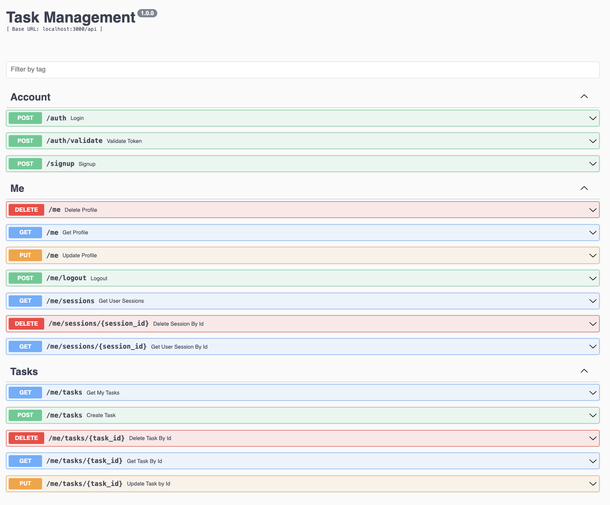

# Globe Task Management API




### References

Check the swagger here [swagger](docs/swagger.yml)<br>
Check the postman collection here [postman](https://documenter.getpostman.com/view/2987353/2sB2cX91ky)<br>

### Prerequisite

1. You need to have latest node at least version `v22.13.0` above.
2. You need to have `postgresql` installed
3. (***Optional***) If you want to run docker setup, you need to have docker `version 28.0.1` or above

### How to run

1. Copy the `sample.env` to `.env`

```bash
cp sample.env .env
```

2. Edit `.env` to the right config you have in your machine

3. Install the dependencies

``` 
npm install
```

4. Run database migration

``` 
npm run migrate
```

5. (***Optional***) You can seed data by running 

```
npm run db:seed
```

6. (***Optional***) You can run test 

```
npm run test
```

7. To run the application in `dev`

```
npm run dev
```

8. To run the application in `prod`  (**NOTE: You need to have docker**)

```
npm run docker:up

# to remove the container
npm run docker:down
```

9. (***Optional***) You can also run test in docker by running (**NOTE: You need to have docker**)

```
npm run docker:test:up

# to remove the container
npm run docker:test:down
```